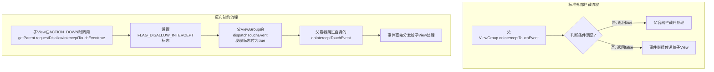

# 事件分发机制中如何反向制约？

好的，这是一个在Android事件分发机制中非常重要且精妙的概念。

### “反向制约”的核心定义

**“反向制约”** 指的是在Android事件分发过程中，**子View** 通过特定方法主动请求或影响**父ViewGroup** 的拦截逻辑的一种机制。这是一种**自下而上**的控制流，与传统的**自上而下**（父容器决定是否拦截）的事件分发方向相反，故得名“反向”。

它的核心实现方法是子View调用： **`Parent.requestDisallowInterceptTouchEvent(true)`**。

---

### 为什么需要“反向制约”？

在标准的“外部拦截法”中，是否拦截事件的决定权完全在**父ViewGroup**手中（在其 `onInterceptTouchEvent` 方法中）。父容器根据业务规则（如滑动方向、距离）做出“一刀切”的决定。

但有些场景下，**子View** 比父容器更了解自己是否需要处理当前事件。例如：

*   **水平滑动的ViewPager内嵌了一个可以垂直滑动的ListView**。
    *   默认规则可能是：横向滑动由父ViewPager处理，纵向滑动由子ListView处理。
    *   **问题**：但如果用户一开始是轻微斜着滑动，ViewPager的`onInterceptTouchEvent`可能误判为横向滑动而进行拦截，导致内部的ListView无法滚动。
*   **子View处于某种特殊状态**（如正在放大、编辑），此时不希望父容器拦截任何事件。

在这种情况下，子View需要一种方式“告诉”父容器：“**我现在需要处理这个事件序列，请你不要拦截**”。这就是“反向制约”要解决的问题。

---

### “反向制约”是如何工作的？（内部拦截法）

这种机制通常与“内部拦截法”配合使用。其工作流程如下：

1.  **父ViewGroup的态度**：父容器默认**拦截除`ACTION_DOWN`之外的所有事件**。即在它的 `onInterceptTouchEvent` 中：
    ```java
    @Override
    public boolean onInterceptTouchEvent(MotionEvent ev) {
        if (ev.getActionMasked() == MotionEvent.ACTION_DOWN) {
            return false; // DOWN事件绝不拦截，保证子View能收到初始事件
        }
        return true; // 其他事件默认先拦截
    }
    ```
    *   这里父容器摆出了一个“强势”的姿态：除非有特殊情况，否则事件我都要管。

2.  **子View的反向请求**：子View在收到`ACTION_DOWN`事件时，就**立即**请求父容器不要拦截。
    ```java
    @Override
    public boolean dispatchTouchEvent(MotionEvent event) {
        switch (event.getActionMasked()) {
            case MotionEvent.ACTION_DOWN:
                // 关键代码：在DOWN事件时，就请求父View不要拦截后续事件
                getParent().requestDisallowInterceptTouchEvent(true);
                break;
            case MotionEvent.ACTION_MOVE:
                // 在移动过程中，如果子View的判断条件不满足了（例如已经滑动到顶部），
                // 可以“收回”请求，允许父容器拦截。
                if (!canScrollFurther()) {
                    getParent().requestDisallowInterceptTouchEvent(false);
                }
                break;
        }
        return super.dispatchTouchEvent(event);
    }
    ```
    *   `requestDisallowInterceptTouchEvent(true)` 这个调用会设置一个标志位（`FLAG_DISALLOW_INTERCEPT`），强制父ViewGroup的 `onInterceptTouchEvent` 方法**在本次事件序列中不被调用**（除了ACTION_DOWN，因为它在调用此方法之前已发生）。
    *   这样一来，事件的生杀大权就完全交给了子View。

3.  **父容器的配合**：父ViewGroup必须尊重子View的请求。所有ViewGroup的 `dispatchTouchEvent` 方法实现中，都已经内置了对这个标志位的检查。如果标志位为`true`，父ViewGroup会跳过自己的 `onInterceptTouchEvent` 方法，直接尝试将事件分发给子View。

### 流程对比图



### 总结与特点

1.  **控制权反转**：决定权从父容器转移到了子View手中。子View从被动的接收者变成了主动的请求者。
2.  **灵活性**：解决了某些复杂场景下，单纯依靠父容器规则无法精确判断的问题，尤其适合处理嵌套滑动的冲突。
3.  **需要父子配合**：
    *   **子View**：需要在合适的时机（通常是`ACTION_DOWN`）主动调用`requestDisallowInterceptTouchEvent`。
    *   **父ViewGroup**：需要提前写好默认的拦截逻辑（拦截除DOWN外的事件），为子View的“制约”留下空间。
4.  **“请求”而非“命令”**：虽然这个词很强大，但它本质上是一个请求。如果父ViewGroup完全不检查这个标志位（自己重写分发逻辑时没处理），那么这个请求就会失效。但系统自带的ViewGroup（如LinearLayout, FrameLayout, ViewPager等）都已经完美支持了这一机制。

因此，**“反向制约”是Android事件分发机制中为解决复杂交互冲突而提供的一种精巧的、自下而上的通信解决方案**。