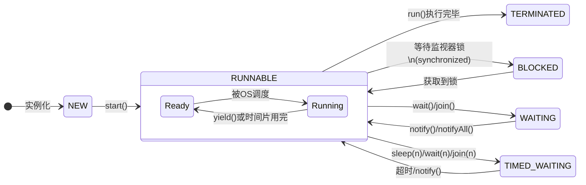

# 请详细介绍Android中，Thread的生命周期。并回答：线程可以多次调用start吗？ 会出现什么问题？

我们来详细解析 Android 中 `Thread` 的生命周期，并回答关于多次调用 `start()` 方法的问题。

首先要明确一个重要概念：**Android 中的线程就是 Java 线程**，因为 Android 开发使用 Java 或 Kotlin 语言，并且其线程模型完全遵循 Java 的标准。因此，`Thread` 的生命周期与在 Java 中是完全一致的。

---

### 一、Thread 的生命周期

在 Java 中，线程的生命周期由 `java.lang.Thread.State` 这个枚举类明确定义。它共包含 **6 种状态**：

1.  **NEW (新建)**
2.  **RUNNABLE (可运行)**
3.  **BLOCKED (阻塞)**
4.  **WAITING (无限期等待)**
5.  **TIMED_WAITING (限期等待)**
6.  **TERMINATED (终止)**

这些状态之间的转换关系可以通过下图清晰地展示（请记住这个状态图，它是理解线程生命周期的核心）：



下面我们详细解释每一种状态：

#### 1. NEW (新建)
*   **描述**：线程对象已经被创建（例如 `Thread thread = new Thread();`），但尚未调用 `start()` 方法。
*   **特点**：此时它仅仅是一个普通的 Java 对象，还没有获得任何操作系统级别的资源，不是一个真正的系统线程。

#### 2. RUNNABLE (可运行)
*   **描述**：调用了线程的 `start()` 方法后，线程就进入了这个状态。
*   **重要理解**：这个状态对应着操作系统线程的 **两种子状态**：**Ready (就绪)** 和 **Running (运行中)**。
    *   **Ready**：线程已经获得了除 CPU 时间片以外的所有资源，正在等待操作系统的线程调度器为它分配 CPU 时间。
    *   **Running**：线程调度器选中了该线程，它正在 CPU 上执行 `run()` 方法中的代码。
*   **注意**：从 Java API 的视角来看，它不区分这两种子状态，统一称为 `RUNNABLE`。我们平常说的“线程正在运行”，通常就是指这个宏观的 `RUNNABLE` 状态。

#### 3. BLOCKED (阻塞)
*   **描述**：线程试图获取一个**内置锁（synchronized 同步锁）**，而该锁正被其他线程持有。
*   **触发条件**：进入 `synchronized` 方法或代码块前竞争锁失败。
*   **结束条件**：当持有锁的线程释放锁，并且该线程被调度器选中成功获取到锁时，它会重新回到 `RUNNABLE` 状态。

#### 4. WAITING (无限期等待)
*   **描述**：线程进入等待状态，需要被其他线程**显式地唤醒**，否则会无限期等待下去。
*   **触发方法**：
    *   `Object.wait()`：不带超时参数。
    *   `Thread.join()`：不带超时参数。等待目标线程终止。
    *   `LockSupport.park()`。
*   **结束条件**：被其他线程通过 `notify()`, `notifyAll()` 唤醒，或者等待的目标线程已终止（对于 `join`）。

#### 5. TIMED_WAITING (限期等待)
*   **描述**：线程进入等待状态，但不会无限期等待，它会在**指定的时间后自动唤醒**，或者在被提前唤醒时退出此状态。
*   **触发方法**：
    *   `Thread.sleep(long millis)`
    *   `Object.wait(long timeout)`：带超时参数。
    *   `Thread.join(long millis)`：带超时参数。
    *   `LockSupport.parkNanos(long nanos)`
    *   `LockSupport.parkUntil(long deadline)`
*   **结束条件**：等待时间到期，或者被其他线程提前唤醒。

#### 6. TERMINATED (终止)
*   **描述**：线程的 `run()` 方法已经执行完毕，或者因异常而提前退出。
*   **特点**：线程已经结束了它的生命周期，不能再被启动。此时它只是一个普通的 Java 对象，等待被垃圾回收。

---

### 二、线程可以多次调用 start 吗？会出现什么问题？

**绝对不可以多次调用 `start()` 方法。**

#### 会出现什么问题？

如果你尝试对一个已经启动过的线程（即状态不为 `NEW` 的线程）再次调用 `start()` 方法，JVM 会抛出一个 **`IllegalThreadStateException`** 运行时异常。

#### 为什么？

原因就藏在线程的生命周期里：

1.  **初始状态**：当你通过 `new Thread()` 创建一个线程对象后，它的内部状态被设置为 `NEW`。
2.  **首次调用 `start()`**：`start()` 方法会做几件重要的事情：
    *   检查线程的当前状态是否为 `NEW`。如果是，则继续；如果不是，则**立即抛出 `IllegalThreadStateException`**。
    *   向操作系统申请资源，将线程加入到操作系统的就绪队列中，等待调度。
    *   一旦线程被调度执行，它的 `run()` 方法就会被调用。
3.  **状态改变**：调用 `start()` 后，线程的状态会立即从 `NEW` 变为 `RUNNABLE`。
4.  **再次调用 `start()`**：此时线程的状态已经是 `RUNNABLE`（或之后的其他状态），而不再是 `NEW`。因此，`start()` 方法中的状态检查会失败，直接抛出异常。

#### 代码示例

```java
Thread myThread = new Thread(() -> {
    System.out.println("Thread is running.");
});

myThread.start(); // 第一次调用，正常，输出 "Thread is running."

try {
    Thread.sleep(1000); // 等待一秒，确保第一个线程已经执行完毕（状态变为TERMINATED）
    myThread.start();   // 第二次尝试调用
} catch (InterruptedException e) {
    e.printStackTrace();
} catch (IllegalThreadStateException e) {
    // 一定会捕获到这个异常
    System.out.println("错误: " + e.toString());
}
```

**输出结果：**
```
Thread is running.
错误: java.lang.IllegalThreadStateException
```

#### 重要结论

*   **一个 `Thread` 对象的生命周期只能从 `NEW` 开始一次**。它的 `start()` 方法也只能成功调用一次。
*   线程执行完毕后，其状态变为 `TERMINATED`，这个对象就无法再次启动了。如果你需要再次执行任务，必须**创建一个新的 `Thread` 实例**。
*   这种设计是符合逻辑的。一个线程代表一个独立的执行路径，这条路径从开始到结束是一次性的。就像人的生命一样，无法重生。

#### 替代方案

如果你需要重复执行任务，但不希望重复创建和销毁线程（因为开销较大），你应该使用：
*   **线程池 (`ThreadPoolExecutor`)**：这是处理重复任务的推荐方式。你可以将任务 (`Runnable`) 提交给线程池，由池中的线程来执行，线程在执行完任务后会回到池中等待下一个任务，而不是死亡。
*   **重启任务本身**：在你的 `Runnable` 的 `run()` 方法内部使用循环，而不是让线程结束。但这需要你自己精细地控制线程的启动和停止。