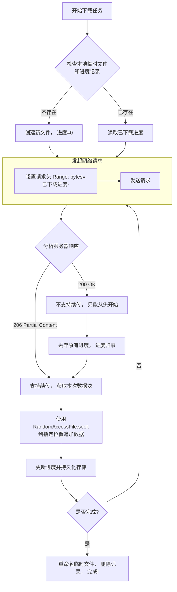

# 断点续传的原理

好的，我们来详细、深入地探讨一下 Android 开发中文件上传和下载的“断点续传”原理。

### 核心概念

**断点续传** 是指在文件传输过程中，允许从上一次传输中断的地方继续传输，而不是从头开始。其核心思想是 **将一个大文件的传输过程分块，并记录每块的传输状态**。

它主要解决了以下痛点：
1.  **节省流量和时间**：对于大文件，网络中断后重新传输成本极高。
2.  **提升用户体验**：用户无需担心网络波动，传输任务可以后台默默继续。
3.  **支持暂停和恢复**：为用户提供了主动控制传输过程的能力。

要实现断点续传，需要 **客户端（Android App）和服务器端协同工作**。两者都需要支持相应的协议或规范。

---

### 一、文件下载的断点续传原理

这是最常见且标准化程度最高的场景，主要依赖 HTTP 协议规范。

#### 1. HTTP 协议支持 - `Range` 和 `Content-Range` 头部

HTTP/1.1 定义了 `Range` 和 `Content-Range` 头部，这是实现下载断点续传的基石。

*   **`Range` (客户端请求头)**：
    客户端告诉服务器需要文件的哪一部分。
    格式： `Range: bytes=0-499` 表示请求前 500 个字节。
    当连接中断，再次请求时，客户端可以发送 `Range: bytes=500-`，表示“请从第 500 个字节开始，直到文件结尾”。

*   **`Content-Range` (服务器响应头)**：
    服务器告诉客户端本次返回的文件内容范围以及文件总大小。
    格式： `Content-Range: bytes 500-999/2000`
    这表示：本次响应返回的是第 500 到第 999 字节的内容，文件总大小是 2000 字节。
    如果服务器不支持断点续传，它会忽略 `Range` 头，返回整个文件（状态码 `200 OK`）而不是 `206 Partial Content`。

#### 2. 客户端（Android App）的工作流程

1.  **初始化下载**：
    *   首先检查本地是否已存在一个对应的**临时文件**（如 `file.zip.tmp`）和**记录文件**（如 `file.zip.db` 或使用数据库记录）。记录文件用于存储当前已下载的字节数。
    *   如果不存在，则创建一个新的临时文件，并将已下载长度初始化为 0。

2.  **发起 HTTP 请求**：
    *   在 HTTP 请求头中设置 `Range` 字段。例如：`Range: bytes=<已下载长度>-`。
    *   使用 `HttpURLConnection` 或 `OkHttp` 等网络库发送请求。

3.  **处理服务器响应**：
    *   如果服务器返回 `206 Partial Content`，表示支持断点续传。此时响应的 `Content-Range` 头会告知本次返回的数据范围。
    *   如果服务器返回 `200 OK`，表示服务器不支持断点续传，本次下载只能从头开始。

4.  **写入文件**：
    *   使用 `RandomAccessFile` 来打开临时文件。
    *   调用 `seek(已下载长度)` 方法，将文件指针移动到文件末尾。
    *   将本次收到的数据流（`InputStream`）追加写入到文件的这个位置。

5.  **更新下载进度**：
    *   实时将新写入的字节数累加到“已下载长度”中，并持久化到记录文件或数据库中。
    *   同时，通过回调接口更新 UI 进度条。

6.  **暂停**：
    *   当用户暂停时，立即停止读取网络流和写入文件，并**将当前的下载进度最新值持久化到记录中**。这是实现续传的关键。

7.  **完成与重命名**：
    *   当检测到“已下载长度”等于服务器声明的“文件总长度”时，下载完成。
    *   将临时文件（`file.zip.tmp`）重命名为最终的目标文件名（`file.zip`）。
    *   删除记录文件。

8.  **异常处理**：
    *   网络异常、写入异常等都会导致传输中断。在 `catch` 块中，必须**保存当前的下载进度**，以便下次续传。

#### 流程图（下载）

---

### 二、文件上传的断点续传原理

上传的断点续传没有像下载那样的通用 HTTP 标准，更多依赖于服务器端设计的 API 规范。但原理是相通的。

#### 1. 常见实现方式

*   **分块上传**：将大文件分割成一个个固定大小（如 1MB）的块（Chunk），然后逐个上传。
*   **校验与合并**：服务器端接收所有分块后，进行校验并合并成原始文件。

#### 2. 客户端（Android App）的工作流程

1.  **文件分块**：
    *   使用 `FileInputStream` 读取本地文件。
    *   根据预设的块大小（如 1MB），将文件逻辑上分成多个块（Chunk 0, Chunk 1, Chunk 2...）。

2.  **查询上传状态**：
    *   开始上传前，先调用一个服务器提供的 **“查询”接口**，询问服务器：“文件 XXX 已经上传了哪些分块？”
    *   服务器返回一个列表，如 `[0, 1, 2]`，表示前三个块已经上传成功。

3.  **上传未完成的块**：
    *   客户端根据服务器返回的列表，计算出哪些块还需要上传（例如，服务器返回了 `[0, 1, 2]`，那么客户端就从第 3 块开始上传）。
    *   对于每一个需要上传的块，构造一个多部分表单数据请求（Multipart Form Data），并在请求体中包含：**文件块数据、当前块的索引（chunk index）、总块数（total chunks）等元信息**。

4.  **记录上传进度**：
    *   每成功上传一个分块，就在本地记录一下（例如，在数据库或文件中记录“文件A的块3上传成功”）。
    *   这样即使 App 被杀死，下次也能知道哪些块已经传过，而无需每次都询问服务器（但为了可靠性，每次启动时询问一次服务器状态是更安全的做法）。

5.  **通知服务器合并**：
    *   当所有分块都上传完毕后，客户端调用另一个 **“合并”接口**，通知服务器：“文件 XXX 的所有分块已上传完毕，请进行合并校验。”
    *   服务器端将所有分块按索引顺序拼接起来，并验证文件的 MD5 或 SHA1 哈希值以确保完整性。

6.  **暂停与恢复**：
    *   暂停时，停止当前块的上传，并持久化记录当前已完成的分块索引。
    *   恢复时，从上次中断的下一块开始继续上传。

#### 3. 服务器端的职责

*   提供**状态查询接口**。
*   提供**上传接口**，接收分块并临时存储，同时记录该文件已接收的分块索引。
*   提供**合并接口**，完成文件的最终组装和校验。
*   需要一个**清理机制**，定期清理未完成合并的临时分块文件，避免占用磁盘空间。

---

### 三、Android 实现中的关键技术点

1.  **文件操作**：
    *   `RandomAccessFile`: 用于在文件的任意位置进行读写，是实现下载追加数据的关键类。
    *   `FileInputStream` + `BufferedInputStream`: 用于高效读取本地文件进行分块上传。

2.  **进度持久化**：
    *   可以使用简单的 **SharedPreferences**、**文件** 或 **数据库**（如 Room）来存储每个下载/上传任务的进度。
    *   存储的信息至少应包括：`文件URL`、`已传输字节数`、`文件总大小`、`临时文件路径`等。

3.  **网络库**：
    *   **OkHttp** 天然支持下载断点续传。其 `Interceptor` 可以方便地添加 `Range` 头，并且其响应体可以方便地写入文件。它内部也提供了完善的异常处理机制。
    *   `HttpURLConnection` 也可以实现，但需要自己处理更多的底层细节。

4.  **后台服务与通知**：
    *   由于文件传输是耗时操作，应放在**后台服务**中执行，如 `WorkManager` 或 `JobIntentService`（考虑 Android 版本差异和后台限制）。
    *   使用 `Notification` 显示传输进度，并提供暂停/继续等操作按钮。

5.  **完整性校验**：
    *   传输完成后，最好对文件进行校验。比较客户端和服务器端文件的 **MD5** 或 **SHA-1** 值，确保文件在传输过程中没有出错。

### 总结

| 特性 | 文件下载 | 文件上传 |
| :--- | :--- | :--- |
| **协议基础** | **HTTP `Range` & `Content-Range`** (标准支持) | **自定义 API** (无统一标准) |
| **核心思想** | 追加写入（Append） | 分块上传（Chunk） |
| **客户端关键** | 1. 发送 `Range` 头 2. 使用 `RandomAccessFile.seek()` 3. 持久化进度 | 1. 文件分块 2. 查询服务器状态 3. 上传未完成块 4. 通知合并 |
| **服务器关键** | 1. 解析 `Range` 头 2. 返回 `206` 状态和部分内容 | 1. 提供状态查询接口 2. 接收并存储分块 3. 提供合并接口 |

简单来说，断点续传的本质就是 **“记录状态 + 分段传输”**。下载依赖于 HTTP 标准协议，而上传则更多地需要客户端和服务器共同设计一套合作机制来实现。在 Android 端，结合合适的网络库、文件操作和持久化技术，就能构建出 robust（健壮）的文件传输功能。